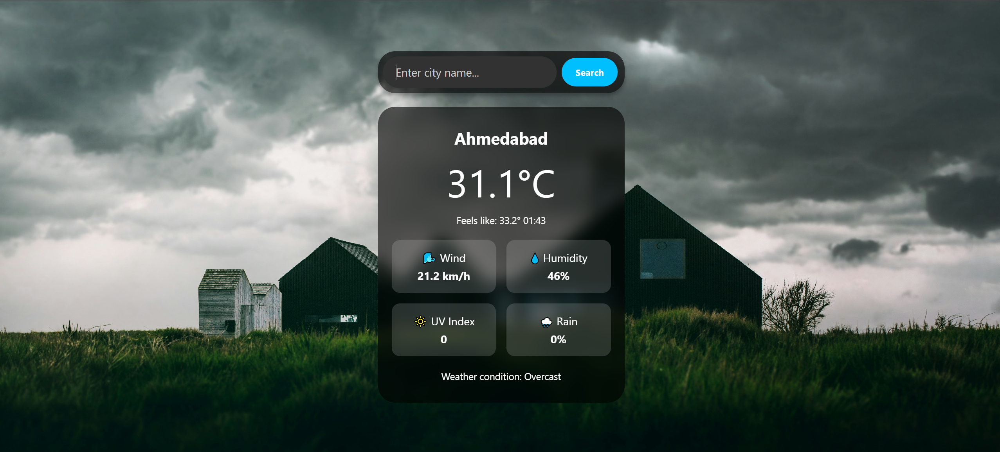

# 🌦️ Weather Widget

A simple and responsive weather widget web application that allows users to search for a city's weather and displays current weather conditions using the WeatherAPI.

---

## ✨ Features

- 🔍 **Search for weather** by city name.
- 🌡️ Displays:
  - **Temperature**
  - **Wind speed**
  - **Humidity**
  - **UV Index**
  - **Rain percentage**
  - **Weather condition description**
- 📱 **Responsive design** with a modern dark-themed UI.

---

## 📂 Project Structure

📦 Weather Widget 
├── index.html 
├── style.css 
├── script.js 
├── image/ 
│   ├── img.jpg 
│   ├── favicon.ico 
│   └── website_img.png 
└── README.md 

---

## 🚀 How to Use

1. **Clone or download** this repository.
2. Open `index.html` in your browser.
3. Enter a city name in the search bar and click **"Search"**.
4. View the weather details for the entered city.

---

## 🌐 API Used

This project uses the [WeatherAPI](https://www.weatherapi.com/) to fetch real-time weather data.  
👉 Replace the `apiKey` in `script.js` with your own API key.

---

## 📄 Files Overview

### 🗂️ [index.html](index.html)
The main HTML file that structures the weather widget.

### 🎨 [style.css](style.css)
The CSS file that styles the weather widget, including the dark theme and responsive design.

### ⚙️ [script.js](script.js)
The JavaScript file that handles:
- Fetching weather data from the WeatherAPI.
- Updating the UI with the fetched data.
- Handling errors and resetting the UI.

### 🖼️ `image/img.jpg`
The background image used for the application.

### 🔖 `image/favicon.ico`
The favicon used for the application.

### 📸 `image/website_img.png`
Screenshot of the weather widget.

---

## 🖼️ Screenshots

---

## 📜 License

This project is open-source and available under the **MIT License**.

